<p align="center">
  
</p>

# agent-dispatch

A lightweight, platform-agnostic skill that acts as an agent registry and **just-in-time router**. Instead of pre-installing 130 agents (211k tokens at startup), your AI agent carries a compact keyword index (2k tokens) and downloads specialists on demand — mid-session, the moment it needs them.

Works with **Claude Code**, **OpenClaw**, **Cursor**, **Codex**, and any platform that supports the SKILL.md format.

**The problem:** pre-installing dozens of subagents bloats your context window. Not installing them means your agent does everything itself. Orchestrator agents are overkill — you'd spawn an agent just to pick an agent.

**The solution:** a single skill file with a TOML index mapping keywords to agent names and their download locations. When a specialist is needed, the skill teaches your agent to fetch it from GitHub, read its instructions, and dispatch — all in one seamless flow.

## How it works

```mermaid
flowchart TD
    A["🧑‍💻 You're coding"] --> B["Agent hits a specialized task"]
    B --> C["🔍 Skill activates\n keyword match"]

    C --> D["📖 Index lookup\nsecurity = security-auditor:quality"]
    D --> E{"🗂️ Cached\nlocally?"}

    E -- "✅ YES" --> G["📄 Read agent instructions"]
    E -- "❌ NO" --> F["⬇️ Download from GitHub\ncurl → ~/.claude/agents/"]
    F --> G

    G --> H["🚀 Spawn Task\ninline prompt"]
    H --> I["🔒 Work done in\nseparate context window"]
    I --> J["📋 Results returned\nto main conversation"]
    J --> K["💾 Agent cached\nfor next time"]

    style A fill:#0d1117,stroke:#58a6ff,color:#c9d1d9
    style B fill:#0d1117,stroke:#58a6ff,color:#c9d1d9
    style C fill:#0d1117,stroke:#3fb950,color:#3fb950,stroke-width:2px
    style D fill:#0d1117,stroke:#3fb950,color:#c9d1d9
    style E fill:#161b22,stroke:#f0883e,color:#f0883e,stroke-width:2px
    style F fill:#0d1117,stroke:#f778ba,color:#f778ba
    style G fill:#0d1117,stroke:#3fb950,color:#c9d1d9
    style H fill:#0d1117,stroke:#a371f7,color:#a371f7,stroke-width:2px
    style I fill:#0d1117,stroke:#a371f7,color:#c9d1d9
    style J fill:#0d1117,stroke:#58a6ff,color:#c9d1d9
    style K fill:#0d1117,stroke:#3fb950,color:#3fb950
```



### Skills vs agents vs MCP

| Mechanism | When loaded | Context impact | Best for |
|-----------|-------------|----------------|----------|
| **Skill** | On-demand during conversation | Into main context (~minimal) | Routing, instructions, capabilities |
| **Agent** | When dispatched | Own context window (zero main impact) | Delegated specialized work |
| **MCP** | At startup before model loads | Consumes context upfront | External tool integrations |

This skill bridges the gap: it's a **skill** (lightweight, on-demand) that routes to **agents** (isolated, specialized), downloading them just-in-time if they're not already installed.

## Installation

### Recommended: skill only (JIT mode)

Install just the dispatch skill — agents download automatically when needed:

```bash
git clone https://github.com/userFRM/agent-dispatch.git
cd agent-dispatch
./scripts/install.sh --skill-only
```

This installs only the dispatch skill (~2k tokens). Agents are fetched from GitHub on demand during your session and cached locally for future use.

### OpenClaw (via ClawHub)

```bash
clawhub install agent-dispatch
```

### Full install (skill + starter pack)

```bash
git clone --recurse-submodules https://github.com/userFRM/agent-dispatch.git
cd agent-dispatch
./scripts/install.sh
```

This installs the skill plus 10 pre-cached starter agents from the VoltAgent submodule.

### Manual (any platform)

Copy `skills/agent-dispatch/SKILL.md` to your platform's skill directory:

| Platform | Skill path |
|----------|-----------|
| Claude Code | `~/.claude/skills/agent-dispatch/SKILL.md` |
| OpenClaw | `~/.openclaw/skills/agent-dispatch/SKILL.md` |
| Cursor | `.cursor/skills/agent-dispatch/SKILL.md` |

## Getting agents

With JIT mode (default), agents download automatically when needed. You can also pre-install them:

### Fetch from GitHub by category

```bash
# List available categories
./scripts/fetch-agents.sh --list

# Fetch specific categories
./scripts/fetch-agents.sh --category quality
./scripts/fetch-agents.sh --category infra

# Fetch a single agent
./scripts/fetch-agents.sh --single debugger:quality

# Fetch all 130 agents from VoltAgent
./scripts/fetch-agents.sh --all

# Fetch from 0xfurai instead
./scripts/fetch-agents.sh --source 0xfurai
```

Available categories:

| Category | Key | Agents | Examples |
|----------|-----|--------|----------|
| Core development | `core` | 10 | api-designer, frontend-developer |
| Language specialists | `languages` | 26 | typescript-pro, python-pro, rust-engineer |
| Infrastructure | `infra` | 16 | docker-expert, kubernetes-specialist |
| Quality and security | `quality` | 14 | code-reviewer, debugger, penetration-tester |
| Data and AI | `data` | 12 | data-scientist, llm-architect |
| Developer experience | `devex` | 13 | refactoring-specialist, documentation-engineer |
| Specialized domains | `domains` | 12 | fintech-engineer, game-developer |
| Business and product | `business` | 11 | product-manager, ux-researcher |
| Meta orchestration | `meta` | 10 | multi-agent-coordinator |
| Research and analysis | `research` | 6 | research-analyst, competitive-analyst |

### Git submodules (pinned versions)

```bash
git submodule update --init
cp vendors/voltagent/categories/04-quality-security/*.md ~/.claude/agents/
```

## Usage

### Automatic (recommended)

Once installed, Claude auto-consults the dispatch index when it encounters specialized tasks. If the agent isn't cached locally, it downloads it from GitHub, reads its instructions, and dispatches — all transparently. No action needed.

### Manual

```
/agent-dispatch
```

### Regenerate index from your agents

```bash
./scripts/generate-index.sh              # Print to stdout
./scripts/generate-index.sh --install    # Update SKILL.md in-place
```

## Dispatch decision logic

The skill instructs Claude to **dispatch** when:
- The task is clearly specialized (security review, performance profiling)
- The agent can work independently with clear inputs/outputs
- The work would consume significant main context

And to **do it inline** when:
- The task is a quick one-liner
- Tight back-and-forth with the user is needed
- The user explicitly asks to handle it directly

## Uninstall

```bash
# Remove skill only (agents untouched)
./scripts/uninstall.sh

# Remove skill + starter pack agents
./scripts/uninstall.sh --agents

# Remove skill + ALL agents in directory (with confirmation)
./scripts/uninstall.sh --all
```

## Cross-platform usage

All scripts respect environment variables for platform-agnostic installs:

```bash
# Override agent directory (default: ~/.claude/agents)
AGENTS_DIR=~/.openclaw/agents ./scripts/fetch-agents.sh --all

# Override skill directory (default: ~/.claude/skills/agent-dispatch)
SKILL_DIR=~/.openclaw/skills/agent-dispatch ./scripts/install.sh

# Override SKILL.md path for index regeneration
SKILL_FILE=~/.openclaw/skills/agent-dispatch/SKILL.md ./scripts/generate-index.sh --install
```

## Known limitations

- Each keyword maps to exactly one agent (TOML requires unique keys)
- Downloaded agents are cached permanently — delete the `.md` file to force re-download
- If you are offline, agents not already cached will be unavailable (the agent handles the task itself)
- ZIP downloads from GitHub don't include submodules — clone with `--recurse-submodules` or use the fetch script

## Customization

Edit `~/.claude/skills/agent-dispatch/SKILL.md` to:
- **Add keywords** for your specific workflows
- **Remove agents** you don't need
- **Add categories** for your domain

The index format is TOML with category suffixes:

```toml
keyword = "agent-name:category"
```

## Works with

This skill is agent-source agnostic. It works with agents from:

- [VoltAgent/awesome-claude-code-subagents](https://github.com/VoltAgent/awesome-claude-code-subagents) (130 agents, MIT)
- [0xfurai/claude-code-subagents](https://github.com/0xfurai/claude-code-subagents) (100+ agents, MIT)
- [affaan-m/everything-claude-code](https://github.com/affaan-m/everything-claude-code)
- Your own custom agents in `~/.claude/agents/`

## Contributing

See [CONTRIBUTING.md](CONTRIBUTING.md).

## License

[MIT](LICENSE)

## Acknowledgments

- Agent definitions from [VoltAgent](https://github.com/VoltAgent) and [0xfurai](https://github.com/0xfurai), both MIT licensed
- Built on [Claude Code's skill system](https://code.claude.com/docs/en/skills)
